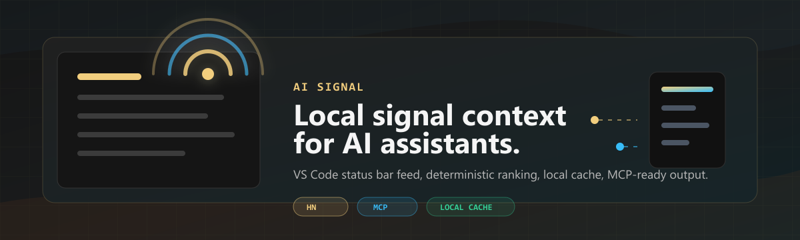
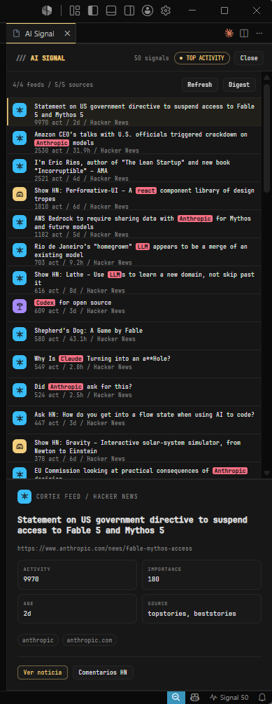

<p align="center">
  
</p>

<h1 align="center">Signal</h1>

<p align="center">
  <strong>Useful technical activity, exposed as local AI context.</strong>
</p>

<p align="center">
  <code>VS Code status bar</code>
  ·
  <code>local cache</code>
  ·
  <code>Hacker News activity</code>
  ·
  <code>MCP-ready</code>
  ·
  <code>personal feed groups</code>
</p>

<p align="center">
  
  
  
  
</p>

<p align="center">
  
</p>

---

Signal is a lightweight VS Code extension and local collector for public technical activity. It keeps a small cache of ranked signals, shows them from the status bar, and is being shaped to expose the same local context to AI assistants through MCP.

The product name is **Signal**. The repository name is **ai-signal** because the project is meant to become a local signal source for AI assistants, not because the collector needs to call an AI model.

## Current Shape

- Status bar entry: click `Signal` to open or close the panel.
- Local collector: fetches Hacker News stories and normalizes the metadata.
- Personal ranking: combines activity, age, configured feed weights, keywords, and domains.
- Persistent cache: stores the latest signal snapshot under `.ai-signal/`.
- Compact panel: shows the ranked list, selected item details, article link, and HN comments.
- Personal taxonomy: groups items into configured feed families instead of generic tech buckets.

## Feed Groups

Signal ships with four opinionated groups:

- `Cargo Bay`: AstroJS, NodeJS, ReactJS, TypeScript.
- `Cortex Feed`: GitHub Copilot, Python, MCP, OpenCode, Perplexity, Cursor, Claude, Cloudflare, agentic AI.
- `Deep Space Relay`: GitKraken, KeePass, Brave, Codex, VS Code.
- `Nostromo Finance`: PostgreSQL, SQL Server, Docker, MariaDB, MongoDB.

The groups are editable in `config/feeds.sample.json`. Matching is intentionally strict: an item must match configured keywords or domains to enter the feed.

## MCP Direction

The planned MCP server will read the local cache and expose it to assistants such as Codex, Claude, OpenCode, or other MCP clients.

Initial tools:

- `signal_get_top`: return ranked signals by period, group, and limit.
- `signal_search`: search cached signals by keyword, domain, group, or source.
- `signal_get_digest`: return a compact digest for one or more groups.
- `signal_get_item`: return the full metadata for a selected signal.
- `signal_get_groups`: list configured feed groups and matching rules.

The assistant does the reasoning. Signal provides clean local context.

> **Status:** implemented as a zero-dependency stdio MCP server in [`src/mcp/`](src/mcp/). All five tools are live and read the local cache (read-only, no fetching during a request). Run it with `npm run mcp` and see [`docs/mcp.md`](docs/mcp.md) for the projected schema and client configuration.

## Install

### From a packaged build (recommended)

```powershell
npx --yes @vscode/vsce package
code --install-extension ai-signal-0.1.0.vsix
```

Reload VS Code, then click `Signal` in the status bar and run `Signal: Refresh Hacker News`.

To remove it later: `code --uninstall-extension local.ai-signal`.

### From source (development)

Open this folder in VS Code and press `F5`. In the Extension Development Host:

- click `Signal` in the status bar;
- run `Signal: Refresh Hacker News`;
- select a story;
- click `Ver noticia` to open the original article;
- click `Comentarios HN` to open the discussion.

> The panel action labels are currently in Spanish (`Ver noticia`, `Comentarios HN`). Localization is on the roadmap.

You can refresh from the terminal without VS Code:

```powershell
node scripts\hn-smoke.mjs --limitPerList 120 --maxItems 50
```

## Local Files

Generated files are ignored by git:

```text
.ai-signal/
  hn-cache.json
  hn-digest.md
```

## Development

No runtime dependencies are required for the current prototype.

The collector keeps its pure logic (classification and ranking) in a small, I/O-free core so it can be tested without network or filesystem:

```text
scripts/
  hn-smoke.mjs          # I/O: fetch, dedupe, persist cache + digest
  lib/signal-core.mjs   # pure: classifyItem, normalizeHnItem, rankItems
  signal-core.test.mjs  # node:test unit tests for the core
```

Validate syntax:

```powershell
node --check scripts\hn-smoke.mjs
node --check src\extension.cjs
```

Run the unit tests:

```powershell
node --test
```

Run the full repo check (syntax + tests):

```powershell
pnpm check
```

If you use a package manager, prefer `pnpm`.

## Roadmap

- ~~Add the MCP server and local tools.~~ Done — see [`src/mcp/`](src/mcp/).
- Add editable feed configuration from the extension UI.
- Add optional `ai-voice` notifications for important refresh events.
- Add more public sources that fit the same local-cache model.
- Localize the panel UI (action labels are currently Spanish).
- Package the VS Code extension when the product surface stabilizes.

## Public Repo Status

This is publishable as an early prototype, with clear caveats:

- Hacker News is the only active collector today.
- The MCP server is implemented (read-only, stdio) and reads the same local cache.
- The feed taxonomy is personal and opinionated.
- Marketplace packaging is not published yet (a local `.vsix` build works).

## License

MIT
